# Firebase-for-Web
Submission of Firebase for Web campaign Capstone Project
<br>
<b>College Management App</b> - One Stop Solution!

### Problem Statement:

Storing Records, Grades, Fee details, Attendance, Staff details in different system can be a big problem at times.

### Proposed Solution :

This project proposes a “Website for brining all the information of college at one place".


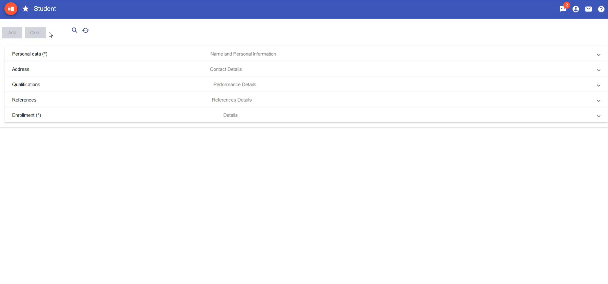
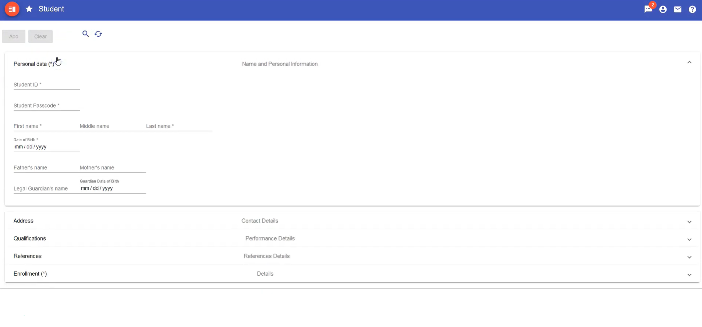
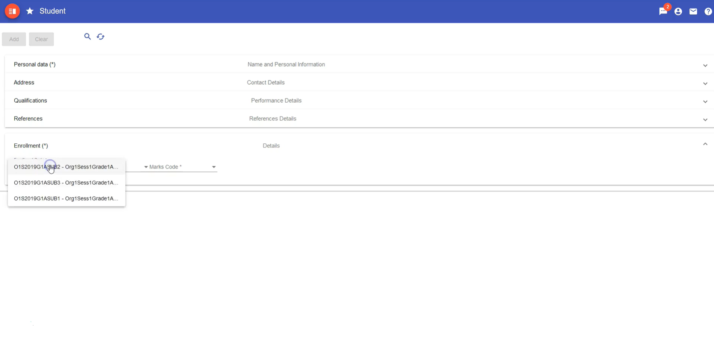
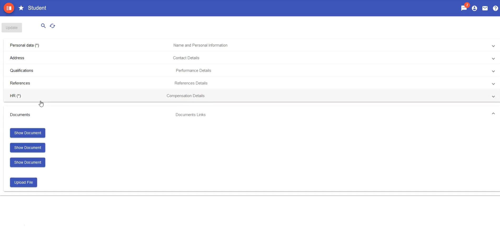
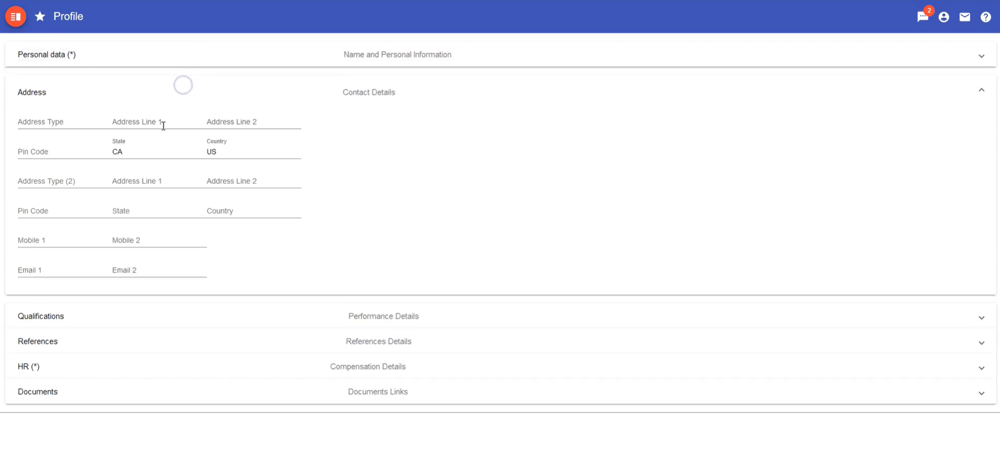
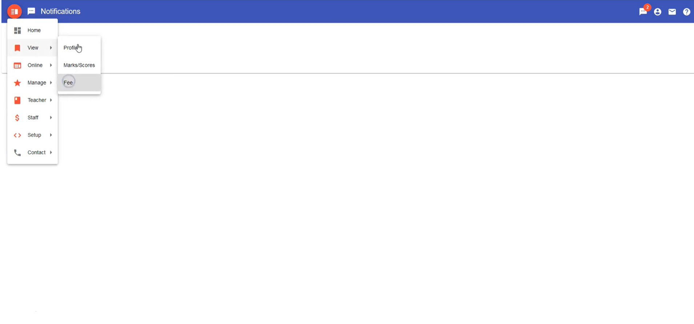
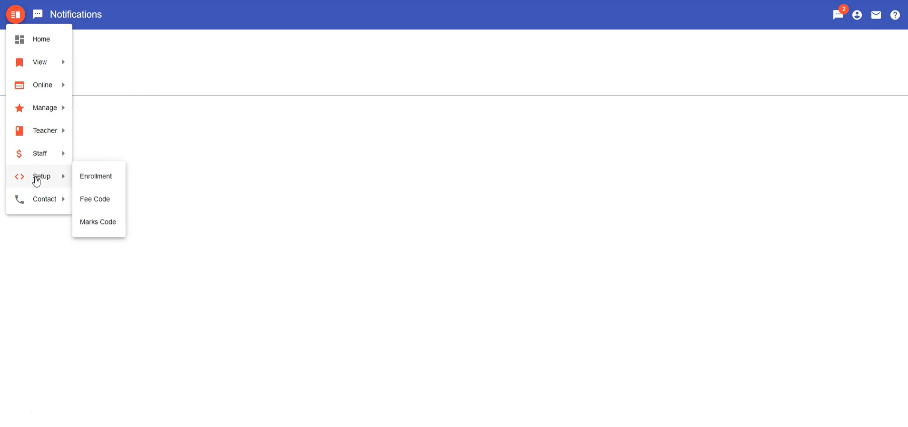
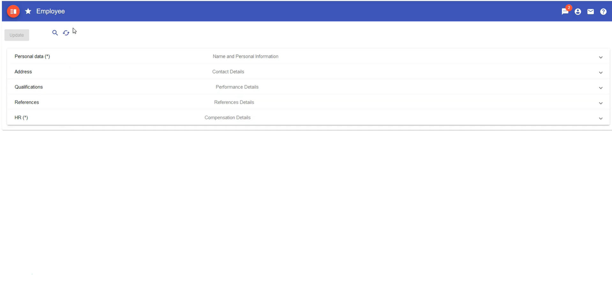
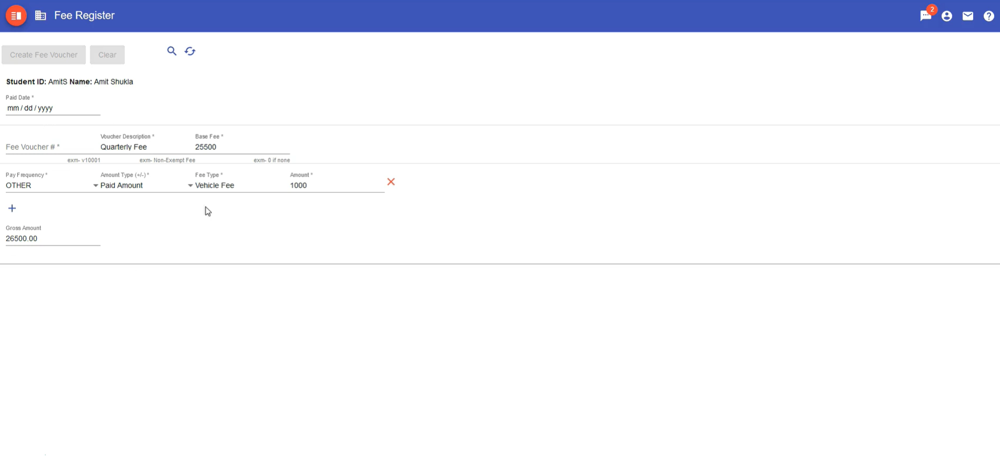
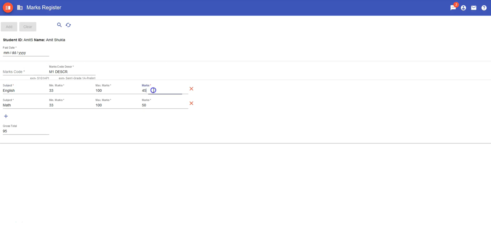
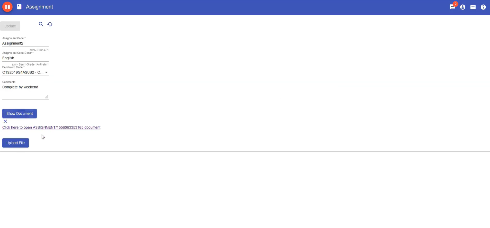


### Instructions:

```
// Install latest version of Node.js from here : https://nodejs.org/en/

$ node -v // make sure, this command comes back with a node version
$ npm -v // make sure, this command comes back with a npm version

// Install Angular CLI
$ npm install -g @angular/cli
$ ng -v // make sure, this command comes back with a npm version
$ mkdir app
$ cd app
$ mkdir client
$ cd client
$ ng new SMA
$ cd SMS
$ ng serve
```

### Key Features :
<ul>
  <li> Authentication for all users</li>
  <li> Instant Password Reset</li>
  <li> Manage entire College stuff online for free</li> 
  <li> Role based access for Student, Parents, Professors and College Management</li>
  <li> Instant access to records at anytime from anywhere</li>
  <li> Notifications (Marks, Fees, Online Assignment posting etc)</li>
  <li>Complete Online College Management App for storing Students Records, Grades, Fee, Attendance, Staff details and a lot more.</li>
</ul>

### Functionality & Concepts used :

The Website has a very simple and interactive interface which helps all its users(students,professors,parents,management) to access all the information anytime from anywhere. Following are few Web and Firebase concepts used to achieve the functionalities in website :
<br> 
<ul><li> Components : to add header, footer, search feature in the website. Header and footer components are reused in the website. </li>
<li> Directives : Define how the view components are placed. It also describes the overall structure of the website components. </li>
<li> Databinding : Show the synchronisation between model and view. It populates the websites after mapping the model and view of each website page.
</li>
<li> Firebase Auth : To authenticate users to the website.</li>
</ul>

### Application Use & Future Scope :
<ul>
   <li>The app is can be used across all colleges aroung the world. </li>
   <li>In future, its scope can be extended to all the educational instituions and many more features can be added.</li>
</ul>
